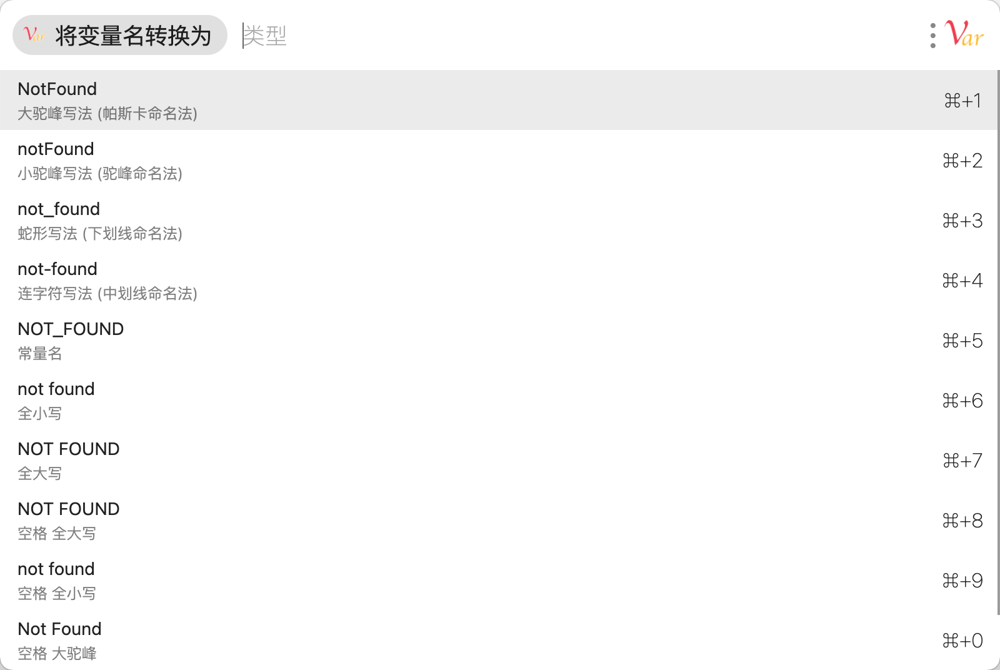

# 变量命名方式兼大小写转换

将 `任意写法变量名` 转换为 `任意写法变量名` ，具体见使用方法。

大小写转换功能是兼职功能，但体验依然良好！

## 使用方法

1. 复制变量名 并 打开 uTools
2. 选择 `将变量名转换为` 即可
3. 在列表中选择对应的命名风格即可自动复制并粘贴

### 小技巧 (各命名风格均可快速选择)

> ***提示***: 最后几个空格写法中 `+` 表示 `空格` ->` `<-

- 大驼峰写法: `d`、`dt`
- 小驼峰写法: `x`、`xt`
- 蛇形写法: `s`、`sx`、`_`
- 连字符写法: `l`、`h`、`lz`、`-`
- 常量名: `c`、`cl`
- 全大写: `qd`、`dx`
- 全小写: `qx`、`xx`
- 空格全大写: `+d`、`kdx`
- 空格全小写: `+x`、`kxx`
- 空格大驼峰: `+dt`、`kdt`
- 空格小驼峰: `+xt`、`kxt`

## 关于

作者：青石 (ImDong)  
博客: [www.qs5.org](https://www.qs5.org)

## 更新日志

2020年11月29日 发布 1.0.0

完成所有功能，如无意外，难有更新

## 开源

托管于 [Github](https://github.com/imdong/Var-Conv)，使用 Apache 协议开源。